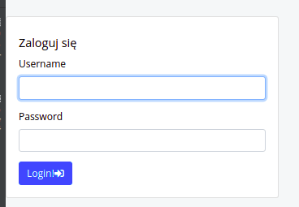
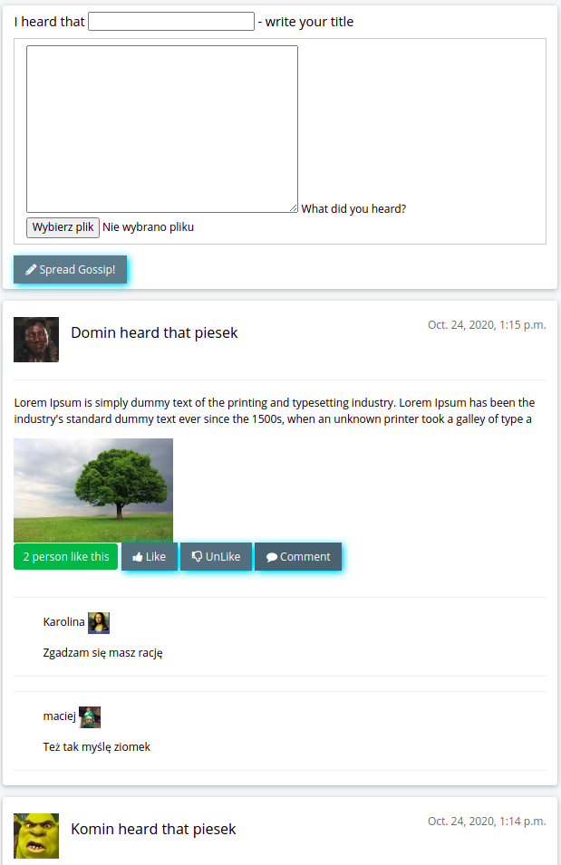
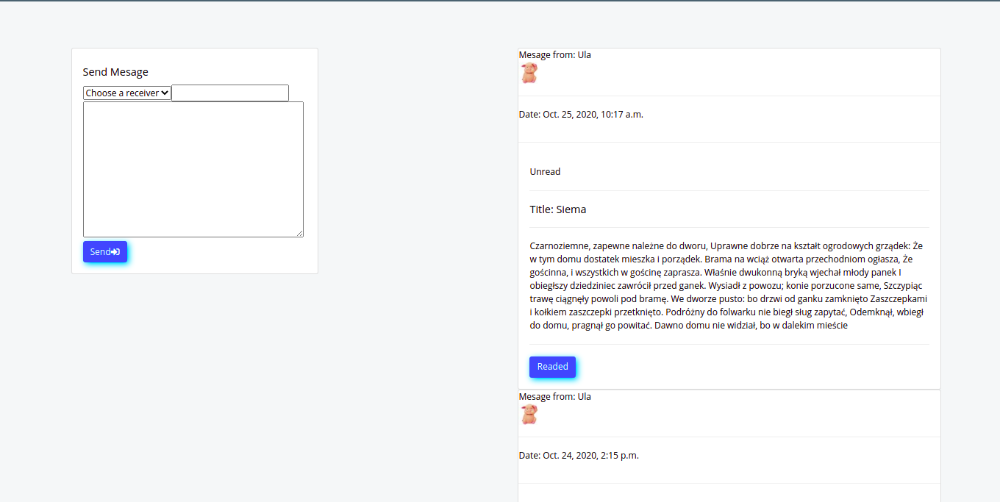
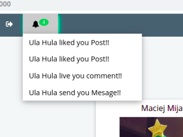
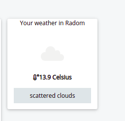
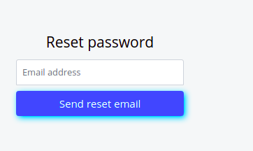
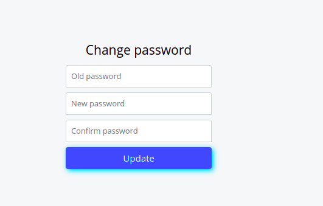
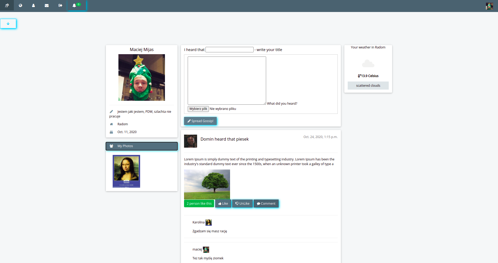

# mysocialweb
Functionalities
1. Login and user creation 

 

2. Avatar for users 
3. Adding posts 
4. Ability to like and unlike posts 
5. Possibility to comment on posts by other users.

6. Send a message

7. Notifications

8. Weather Api

9. Password restart via E-mail 

10. Password change by user view

Homepage View

